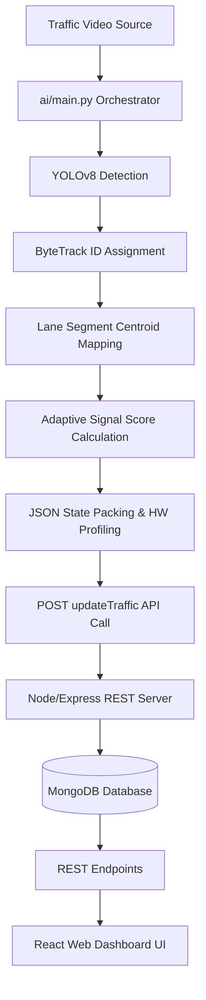

# Smart Traffic Management System

An end-to-end, real-time smart traffic signal controller and dashboard. The system tracks vehicle crossings, classifies lane density queues using YOLOv8 and ByteTrack, runs a starvation-preventative signal timing scheduler (Priority Ageing), logs metrics, and serves traffic stats via an Express REST API backend to a React Web Dashboard.

---

## 1. System Architecture



---

## 2. Folder Structure

```
Project Root/
├── ai/                      # AI Computer Vision Pipeline
│     ├── main.py            # Main Orchestrator and API poster
│     ├── vehicle_detection/ # YOLOv8 Tracker modules (Phase 2)
│     ├── lane_detection/    # Lane polygons segmentation (Phase 3)
│     ├── signal_control/    # Scheduling controller (Phase 4)
│     ├── Dockerfile         # Python service container config
│     └── requirements.txt   # Python packages checklist
├── backend/                 # Node.js Express REST API (Phase 5)
│     ├── server.js          # App entrypoint and listener
│     ├── controllers/       # Route handlers
│     ├── models/            # Mongoose MongoDB schemas
│     ├── routes/            # REST endpoint paths
│     ├── services/          # CSV seeder importer service
│     └── Dockerfile         # Backend container config
├── frontend/                # React Vite Dashboard UI (Phase 6)
│     ├── src/               # React pages, components, services, and styles
│     └── Dockerfile         # Production Nginx frontend builder
├── docs/                    # Requirements documents
├── output/                  # Stored benchmark logs and annotated videos (Git ignored)
├── docker-compose.yml       # Orchestrates MongoDB, API, Frontend, and AI services
├── run_pipeline.py          # Unified system diagnostics test script
├── LICENSE                  # MIT License details
└── CONTRIBUTING.md          # Open-source contributing guidelines
```

---

## 3. Technology Stack

- **AI/ML**: Python 3.10, PyTorch, Ultralytics YOLOv8, ByteTrack, OpenCV, psutil.
- **Backend API**: Node.js, Express.js, MongoDB, Mongoose, Axios.
- **Frontend UI**: React, Vite, React Router, Recharts, Custom CSS.
- **Deployment**: Docker, Docker Compose, Nginx.

---

## 4. API Reference Documentation

### Core Client Endpoints
- `GET /api/traffic/current`: Latest vehicles counts and densities per lane.
- `GET /api/traffic/history`: History of traffic logs.
- `GET /api/traffic/analytics`: Calculated busiest lane, average traffic, and total vehicles.
- `GET /api/signals/current`: Green light lane, active color state, and remaining countdown.
- `GET /api/signals/history`: Chronological transition log of light switches.
- `GET /api/health`: Express API connection status and MongoDB connectivity health check.

### Internal Write Endpoint
- `POST /api/internal/updateTraffic`: Direct JSON payload gateway for pipeline frame telemetry.

---

## 5. How to Run Locally

### 1. Prerequisites
- Install **Node.js** (v18+) and **Python** (v3.10+).
- Ensure **MongoDB** is running locally at `mongodb://localhost:27017/`.

### 2. Configure Environment
Create `.env` inside `backend/` and `frontend/` folders matching their respective `.env.example` templates.

### 3. Run Setup & Diagnostics
Verify that all packages and local network systems pass tests:
```bash
python run_pipeline.py
```

### 4. Startup Components
- **Backend Server**:
  ```bash
  cd backend
  node server.js
  ```
- **Frontend Dashboard**:
  ```bash
  cd frontend
  node node_modules/vite/bin/vite.js
  ```
- **AI Pipeline**:
  ```bash
  cd ai
  python main.py --video datasets/day.mp4
  ```

---

## 6. Docker Deployment (Recommended)

To deploy the entire system (Database, REST Server, React Dashboard, and AI loop) with a single command:
```bash
docker compose up --build
```
- **React Dashboard UI** will be active at `http://localhost/` (Port 80).
- **Express Backend API** will be active at `http://localhost:5000/`.
